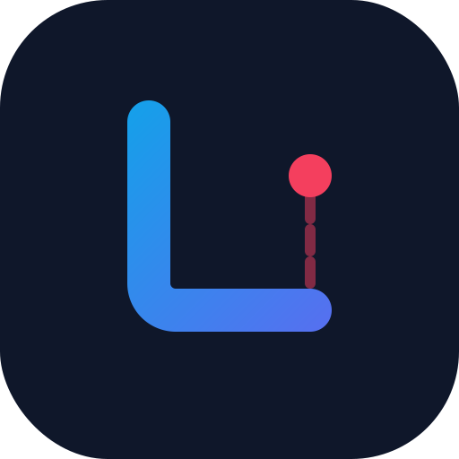

# 🚀 Lexaa

> **Replace concepts in webpages with your own words using AI. Supercharge your language learning!**



Lexaa turns your everyday browsing into a **dynamic language-learning playground**.  
By intelligently replacing words and concepts on real web pages with your personal vocabulary list, it helps you master new terms through natural, in-context reading.

---

## ✨ Features

- 🧠 **Smart replacements:** Finds concepts on any page and replaces them with your chosen vocabulary, powered by AI (Gemini 2.0 Flash).
- 📝 **Personal word lists:** Add your own words and phrases you want to practice. AI automatically extracts up to 10 related concepts per word.
- 📈 **Progress tracking:** See how much you've learned with the **Knowledge Collected tracker** (your personal "Brain Jug") with daily goals and smooth animations.
- ⚡ **Optimized performance:** Batch processing and intelligent caching reduce API calls by up to 95%, saving tokens and costs.
- 🎨 **Beautiful UI:** Modern, gradient-based design with smooth animations and micro-interactions.
- 🔐 **Your data stays yours:** No hard-coded API keys — your key stays private in your browser.
- 🌐 **Works almost everywhere:** Enhances most websites (excludes Chrome internal pages).
- ♿ **Accessible:** ARIA labels, live regions, and keyboard navigation support.

---

## 🚀 Installation

1. Download or clone this repository:

    ```bash
    git clone https://github.com/Angdupsilon/Lexaa.git
    ```

    [GitHub Repo](https://github.com/Angdupsilon/Lexaa)

2. Open Chrome and navigate to `chrome://extensions/`
3. Enable **Developer mode** (top right).
4. Click **Load unpacked** and select the project folder.

---

## 🛠️ Usage

1. Click the Lexaa icon in your Chrome toolbar.
2. In the popup, go to **Settings** and enter your [Gemini API key](https://aistudio.google.com/app/apikey).
3. Add words or phrases you want to learn. Lexaa will automatically extract related concepts using AI.
4. Click **Process Page** to transform concepts on the current webpage.
5. Track your daily learning with the **Brain Jug / Knowledge Collected tracker**! Watch your progress with smooth animations and motivational messages.

---

## 🎯 Key Improvements

### Performance Optimizations
- **Batch Processing:** Processes multiple paragraphs simultaneously, reducing API calls by up to 95%
- **Smart Caching:** Intelligent response caching prevents duplicate API requests
- **Pre-filtering:** Skips irrelevant content before sending to AI, saving tokens

### Enhanced User Experience
- **Modern Design:** Beautiful gradient-based UI with smooth animations
- **Progress Tracking:** Daily goals with contextual progress messages and visual feedback
- **Live Updates:** Real-time progress updates when viewing replaced words
- **Multiple Concepts:** AI extracts up to 10 related concepts per vocabulary word

### Accessibility
- **Screen Reader Support:** ARIA live regions announce progress updates
- **Keyboard Navigation:** Full keyboard support with proper focus states
- **Clear Labels:** Descriptive ARIA labels for all interactive elements

---

## 📊 Technical Details

- **AI Model:** Google Gemini 2.0 Flash
- **Batch Size:** 5 paragraphs per API call
- **Cache Size:** 100 entries (LRU eviction)
- **Daily Goal:** 200 words learned per day
- **Browser Support:** Chrome/Chromium-based browsers (Manifest V3)

---

## 🔭 Future Plans

- Automatic adjustments across different sites
- Export & import your vocabulary lists
- More language support
- Customizable replacement rules and sensitivity
- Additional UI themes and customization options

---

© 2025 Angdupsilon. Currently shared under the MIT License — see [LICENSE](LICENSE).
